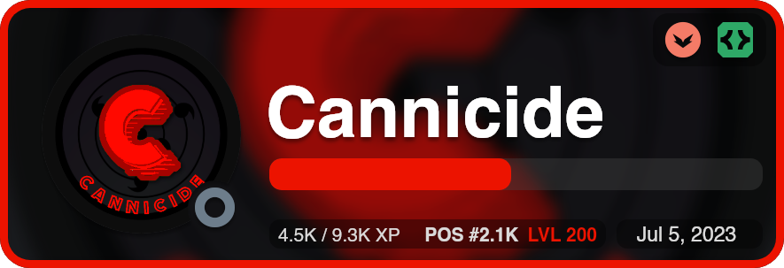

<div align='center'>
  
  <p align='center'>
  <a href='https://www.npmjs.com/package/discord-arts'>
    
    
    
  </a>
</p>
</div>

<p align="center">
  <strong>- Customized cards with Discord style -</strong>
</p>

***

# 📦 Installation

```bash
npm i discord-arts-zhorde@latest
```

This package, `discord-arts-zhorde`, is a custom fork of the original `discord-arts` by iAsure.\
This package adds more customizability and options, to be used by the official discord bot of the ZombieHorde (zhorde) Minecraft server.

**Note: this package is not directly compatible with code made using the original `discord-arts`. Slight changes have been made to sending and configuring cards.**

# ✨ Features

+ 🚀 Fast generation!
+ 🎨 Simple and beautiful design
+ 🎖️ Now easier to use than ever!
+ 💎 Beginner friendly
+ 🚫 Does not require Discord.js!

# 🌟 Extra Features In `discord-arts-zhorde`

+ 🖌️ Customize level label color
+ 🥇 Automatically color rank label for 1st, 2nd, 3rd place
+ 🔠 Auto-abbreviate XP, level, rank numbers as large as 93 digits (9630 -> 9.6K)
+ 🔆 Brighten XP progress bar
+ 😎 Customize background brightness
+ 🫠 Increase background blur
+ 📅 Use custom date in date label
+ 📈 Send cards even easier in Discord.js!

# 🖼️ Cards

## 🪄 profileImage(userId, imgOptions?)

*Generates the card of a user/bot, with its badges.*

```ts
profileImage(userId, {
  customTag?: string, // Text below the user
  customBadges?: string[], // Your own png badges (path and URL) (46x46)
  customBackground?: string, // Change the background to any image (path and URL) (885x303)
  overwriteBadges?: boolean, // Merge your badges with the discord defaults
  badgesFrame?: boolean, // Creates a small frame behind the badges
  removeBadges?: boolean, // Removes badges, whether custom or from discord
  removeBorder?: boolean, // Removes the image border, custom and normal
  usernameColor?: string, // Username HEX color
  tagColor?: string, // Tag HEX color
  borderColor?: string | string[], // Border HEX color, can be gradient if 2 colors are used
  borderAlign?: string, // Gradient alignment if 2 colors are used
  presenceStatus?: string, // User status to be displayed below the avatar
  squareAvatar?: boolean, // Change avatar shape to a square
  rankData?: {
    currentXp: number, // Current user XP
    requiredXp: number, // XP required to level up
    level: number, // Current user level
    rank?: number, // Position on the leaderboard
    barColor?: string, // HEX XP bar color

    // === Options added in discord-arts-zhorde: ===

    levelColor?: string, // HEX color of LVL text
    autoColorRank?: boolean, // Whether to color ranks as medal colors for 1st, 2nd, 3rd
    brighterBar?: boolean, // Increases brightness of XP bar
  },

  // === Options added in discord-arts-zhorde: ===

  moreBackgroundBlur?: boolean, // Triples blur of background image
  backgroundBrightness?: number, // Set brightness of background from 0-200%
  customDate?: Date, // Custom date to use instead of when user joined Discord
});
```

#### Returns: **[Promise](https://developer.mozilla.org/en-US/docs/Web/JavaScript/Reference/Global_Objects/Promise)<**[DiscordCard](index.d.ts)**>**

***

### 📃 Discord.js v14 Interaction Example

```js
const { AttachmentBuilder } = require('discord.js');
const { profileImage } = require('discord-arts');

await interaction.deferReply();
const user = interaction.options.getUser('user-option');

const card = await profileImage(user.id, {
  customTag: 'Admin',
  ...imgOptions
});

// discord-arts-zhorde allows you to directly attach cards:
interaction.followUp(card);
// Or card.followUp(interaction);
```

### 📃 Discord.js v14 Message Example
```js
// discord-arts-zhorde allows you to directly attach with messages, too:
message.reply(card);
// Or card.reply(message);
```

### 📃 Directly Using Buffer
```js
// Need the buffer? Discord-arts-zhorde has got you covered:
const buffer = card.buffer();

// And then use the buffer wherever you'd like, e.g:
interaction.followUp({ files: [buffer] });
```

***

### 🖼️ Example Results 

## Default Card

> 
>> ```javascript
>> profileImage('UserID')
>> ```

***

## Rank Card

### Original `discord-arts` Options
> 
>> ```javascript
>> profileImage('UserID', {
>>   customBadges: [  './skull.png', './letter.png', './rocket.png', './crown.png', './hearth.png'  ],
>>   borderColor: '#087996',
>>   presenceStatus: 'dnd',
>>   badgesFrame: true,
>>   rankData: {
>>     currentXp: 2100,
>>     requiredXp: 3000,
>>     rank: 10,
>>     level: 20,
>>     barColor: '0b7b95'
>>   }
>> });
>> ```

### Extended `discord-arts-zhorde` Options
> 
>> ```javascript
>> profileImage('UserID', {
>>   borderColor: "#ff0000",
>>   presenceStatus: 'offline',
>>   badgesFrame: true,
>>   rankData: {
>>     currentXp: 4562,
>>     requiredXp: 9302,
>>     rank: 2100,
>>     level: 200,
>>     barColor: "#ff0000",
>>     // === All of the following were added in discord-arts-zhorde: ===
>>     levelColor: "#ff0000",
>>     autoColorRank: true,
>>     brighterBar: true
>>   },
>>   // === All of the following were added in discord-arts-zhorde: ===
>>   moreBackgroundBlur: true,
>>   backgroundBrightness: 70,
>>   customDate: new Date(),
>> });
>> ```

***

## Custom User Card

> 
>> ```javascript
>> profileImage('UserID', {
>>   customBadges: [ './booster.png','./orange.png', './giveaway.png' ],
>>   overwriteBadges: false,
>>   usernameColor: '#d9dfef',
>>   borderColor: ['#f90257', '#043a92'],
>>   presenceStatus: 'idle',
>>   squareAvatar: true
>> });
>> ```

***

## Custom Bot Card

> 
>> ```javascript
>> profileImage('UserID', {
>>   customTag: 'Minecraft Bot',
>>   customBackground: './imgs/axoBackground.png',
>>   customBadges: [ './booster.png','./orange.png'],
>>   usernameColor: '#ffbddf',
>>   borderColor: '#fe6a90',
>>   presenceStatus: 'online',
>>   squareAvatar: true,
>>   badgesFrame: true
>> });
>> ```

***

> # ⭐ Credits
> View original github repository that this was forked from [here](https://github.com/iAsure/discord-arts)
>
> ### `discord-arts` created by [iAsure#0001](https://discord.com/users/339919990947971105)
> ### `discord-arts-zhorde` forked and modified by Cannicide#2753
